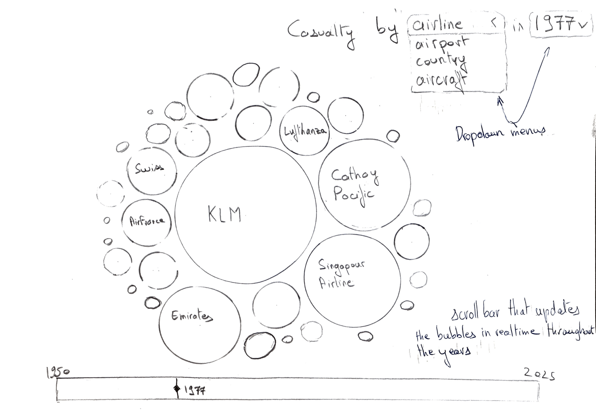
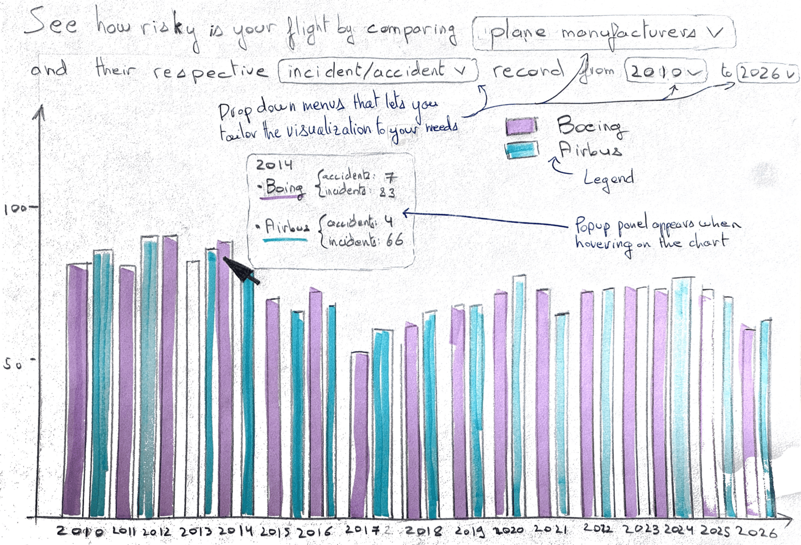
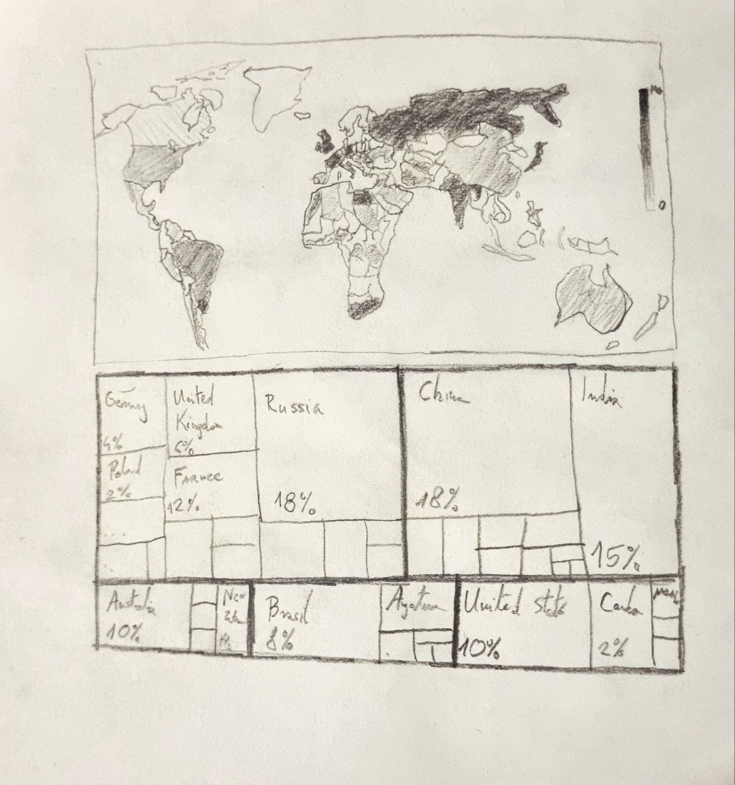
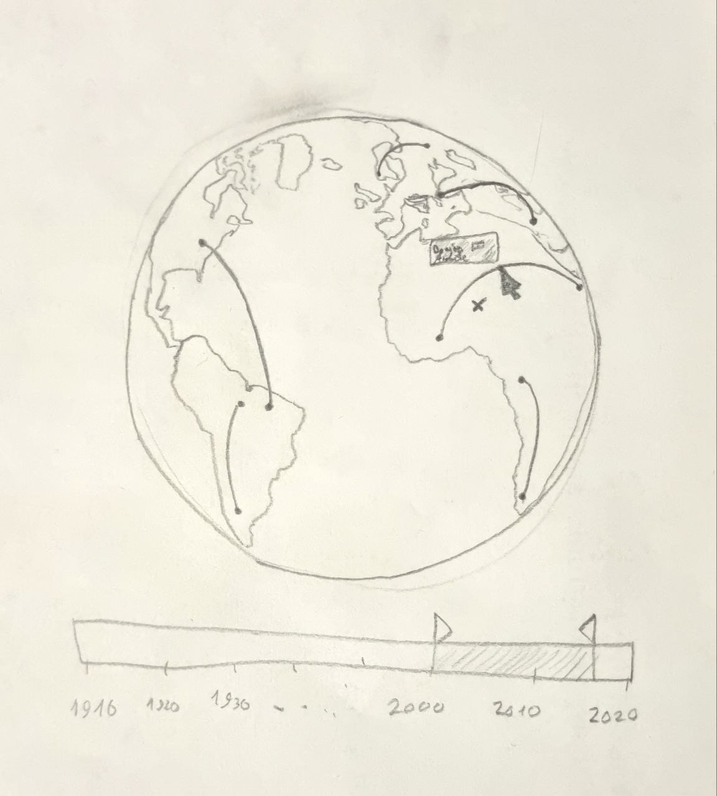
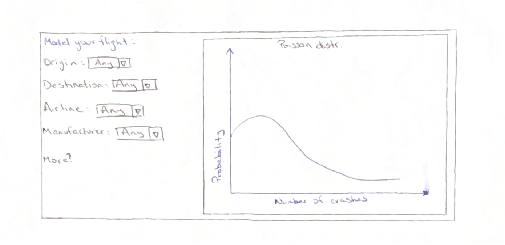
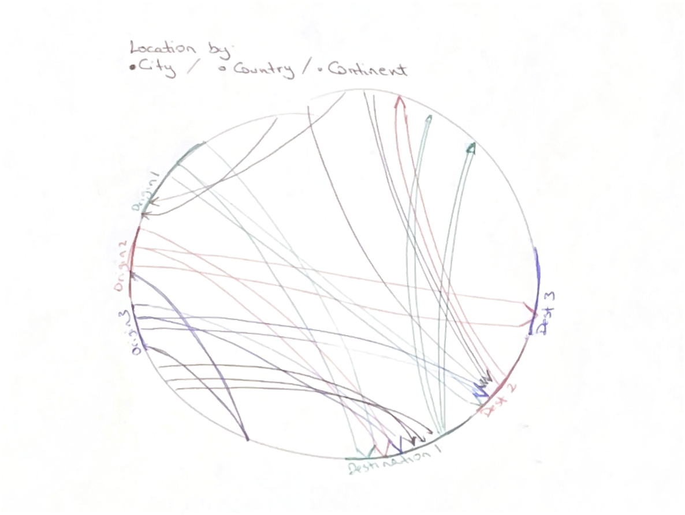

# Project of Data Visualization (COM-480)

| Student's name | SCIPER |
| -------------- | ------ |
| Nicolas Karmolinski | 316655 |
| Roméo Maignal | 360568 |
| Jakub Kielar | 423372|

## Milestone 2 (Friday 1st May, 5pm)

At flight inspectors, we will seek to illustrate the risk of flying through the lens of various different factors. More specifically, we’d like to implement visualizations to make sense of the effects that the different variables have on flight accidents. How has safety increased throughout the years? Are some airlines or manufacturers more prone to crashes? Are there cities that are noticeably dangerous to fly in or out of? Our website will be ordered to sequentially display visualizations that explore these points, finishing with an interactive plot where users will be able to select the variables and estimate the crash risk for a custom flight.

The skeleton of our core visualization can be found at the end of the page.

### Early sketches and tools/lectures we will use to implement each of them

#### Sketch 1: Biggest actors involved in plane crashes

This bubble plot will display the number of crashes for a given aircraft, airline, destination, etc, across the years, using a dropdown for the category and a slider for the year. The size shall be scaled with the number of incidents, highlighting the riskiest variables.

For this visualization, we will make use of the *5_1_Interaction*, *6_1_Perception_colors* and *10_Graphs* and *D3.js* lectures along with library of the same name.

#### Sketch 2: Comparison of different aviation actors and their crash records

This visualization will enable users to compare the influence of different actors on plane crashes. For instance, it can be a helpful tool if you'd like to compare the safety of fierce rivals like Airbus and Boeing over the years.

   

For this visualization, we will make use of the *5_1_Interaction*, *10_Graphs* and *D3.js* lectures along with library of the same name.

#### Sketch 3: Heat- and tree-maps of plane crash locations

With the heatmap, we can geographically represent where most crashes happen, allowing the user to take that into consideration when planning a flight route. The treemap would help establish a clearer sense of scale for this information. By showing the percentage of crashes per country and per continent (as we include both levels of granularity), the visualization highlights the relative distribution of crashes, which can be easily compared visually through rectangle size.

For this visualization, we will make use of the *5_1_Interaction*, *8_1_Maps*, *10_Graphs* and *D3.js* lectures along with library of the same name.

#### Sketch 4: Globe displaying flight routes where planes have crashed

Visualizing a globe enables us to have more realistic perception of flight routes, to see over which countries the flight route leads, which would be hard to represent on mercator map. The slider below the globe enables the user to select specific periods of time that they are interested in representing on the globe.

For this visualization, we will make use of the *5_1_Interaction*, *8_2_Practical_Maps* and *D3.js* lectures along with library of the same name.

#### Sketch 5: Predictive model: Custom flight risk estimator

For the main product of our website, we aim to create a predictive modeling tool which will let the user input the details of a flight and return a Poisson distribution curve detailing the probability of that specific flight having x accidents over a certain period of time. The intent behind this visualization is to allow users to evaluate the danger of a custom flight based on the data that we have.

For this visualization, we will make use of the *5_1_Interaction* and *D3.js* lectures along with library of the same name.

#### Extra sketch: Relationship graph between origin and destination of flight routes

This visualization would be a directed chord diagram linking the different intended routes of flights that crashed. The idea would be to get an understanding of which cities are most dangerous to fly to or from, as in a densely populated graph like this one, considering we would have around 4000 relationships, cities with the most connections should easily stand out. However, this may mean that the visualization would be too cluttered and illegible, thus we might have to resort to classifying cities based on their country or continent, which is doable but potentially slightly irrelevant. Therefore, we may scrap this visualization if we finally deem it to be uninteresting. This will require lectures on graphs and colors and marks.

### Website prototype
The initial implementation of our website with the basic skeleton of the visualization/widgets is running live at the following url :
[https://com-480-data-visualization.github.io/flight-inspectors/](https://com-480-data-visualization.github.io/flight-inspectors/)

Our site is built with the following tools :
 - [Vite](https://vite.dev/) as our local development server
 - [React](https://react.dev/) as our UI/UX design library
 - [TailwindCSS](https://tailwindcss.com/) as our CSS framework
 - [TypeScript](https://www.typescriptlang.org/) as a type safe alternative to javascript

Note that the background of the Navigation Bar is blurred in the local build of the website. However, on Github Pages the background is not rendered properly for reasons currently being researched.
